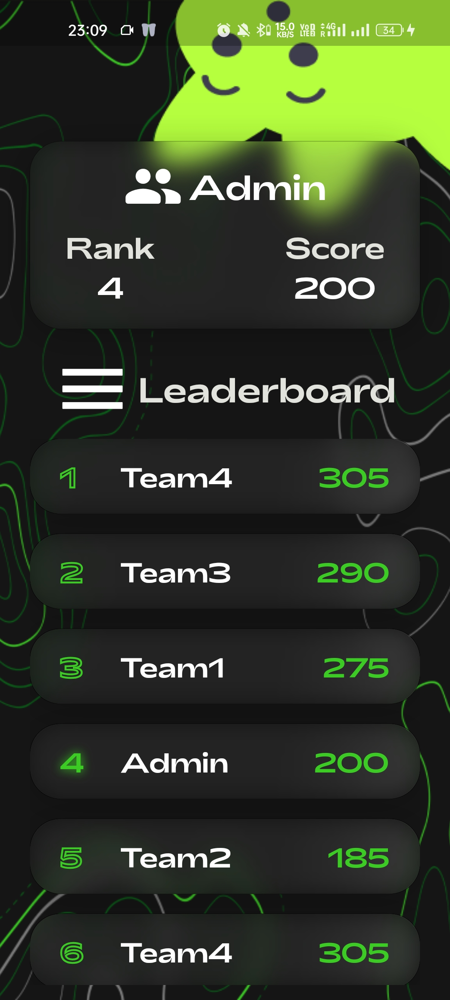

<p  align="center"><a  href="https://www.codechefvit.com"  target="_blank">
</a>

</p>

  

<h2  align="center"> Clueminati App </h2>

<br/>

  

> app that was used in the event clueminati

> this was not updated in the playstore at the time

---

  

[](https://docs.flutter.dev)

[

](https://www.figma.com/file/zwfFa4gwDGe21CyUpcSM7b/Clueminati?type=design&node-id=0%3A1&mode=design&t=9icsoQcNoSCYefBN-1)


## Features

- Auth functionality in Firebase
- QR scanning of clues
- Active leaderboard deployed on firestore

  

## Screenshots

<p  align="center">
  
  
   
  
  
</p>

  
  

## Dependencies

- flutter SDK

## Instructions

  

#### Directions to Install

```sh

$  git clone https://github.com/CodeChefVIT/clueminati-app

$  cd clueminati_app

$  flutter pub get

$  flutter build apk --release --verbose

```

#### Directions to Run

```sh

$ flutter pub get

$  flutter  run

```

## Contributors

<table>

<tc  align="center"  style="font-weight:bold">

<td>

Vaibhav Pandey

<p  align="center">


</p>

<p  align="center">

<a  href = "https://github.com/vaibhavppandey">


</a>

</p>

</td>

<td>

Ryan Jacob

<p  align="center">


</p>

<p  align="center">

<a  href = "https://github.com/notryanjacob">


</a>

</p>

</td>

<td>

Ryan Jacob

<p  align="center">


</p>

<p  align="center">

<a  href = "https://github.com/tanmaydhelia">


</a>

</p>

</td>


</tc>

</table>

  

## License

[](http://badges.mit-license.org)

  

<p  align="center">

Made with :heart: by <a  href="https://www.codechefvit.com"  target="_blank">CodeChef-VIT</a>